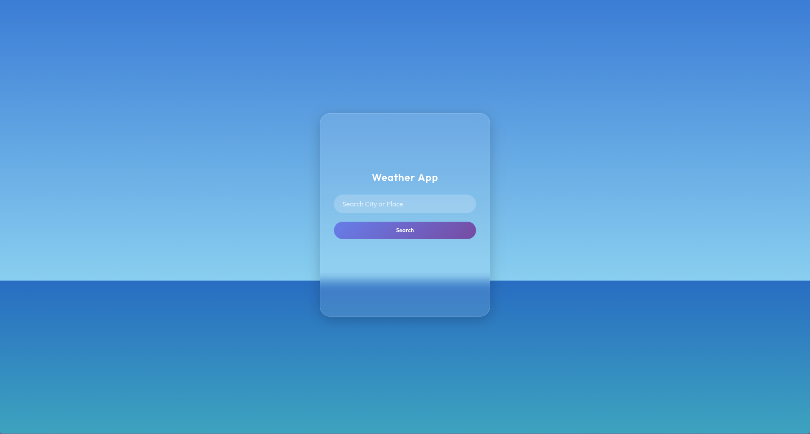
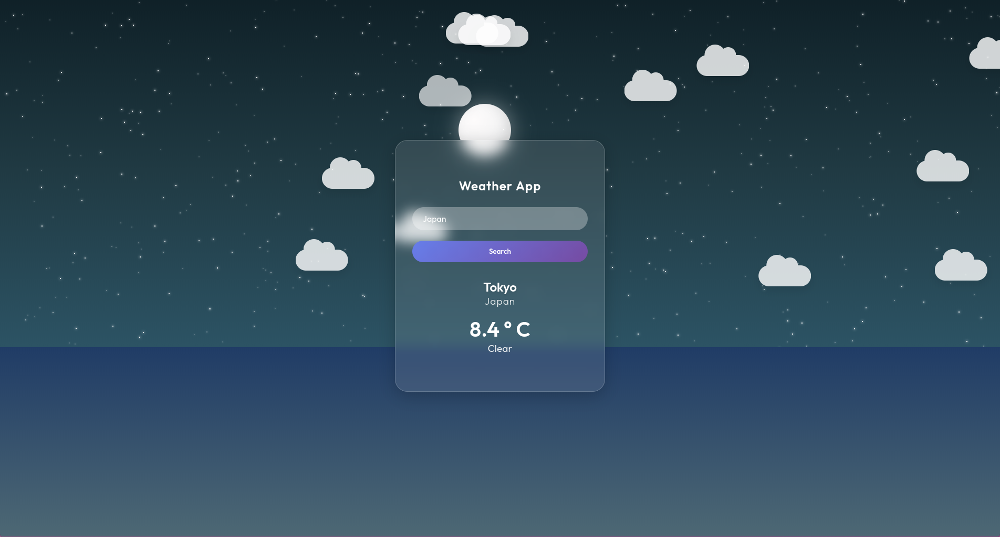
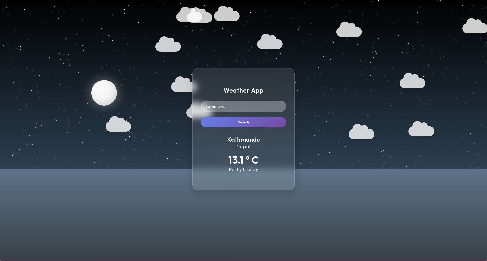
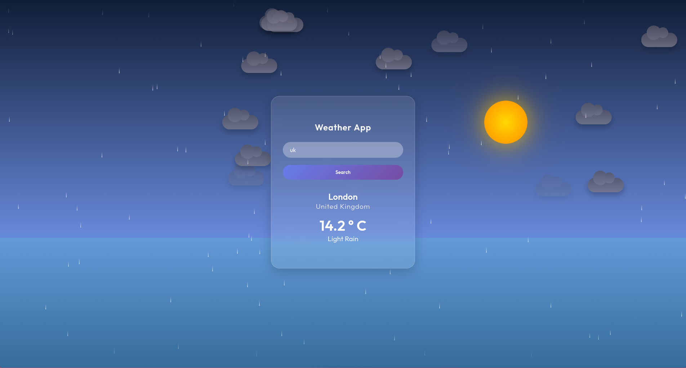

# Weather Web App Project

A visually immersive weather application that dynamically adapts its environment to reflect real-time weather conditions in any searched location.

## Key Features

- Dynamic Weather Scenes – Sun, moon, clouds, ocean, and other elements change seamlessly based on the selected location’s weather.

- Liquid Glass-Inspired UI – A sleek and modern interface inspired by Apple’s Liquid Glass concept.

- Default Theme – A warm, sunny day with light clouds and a calming ocean backdrop.

## Screenshots

